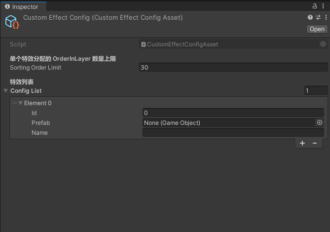
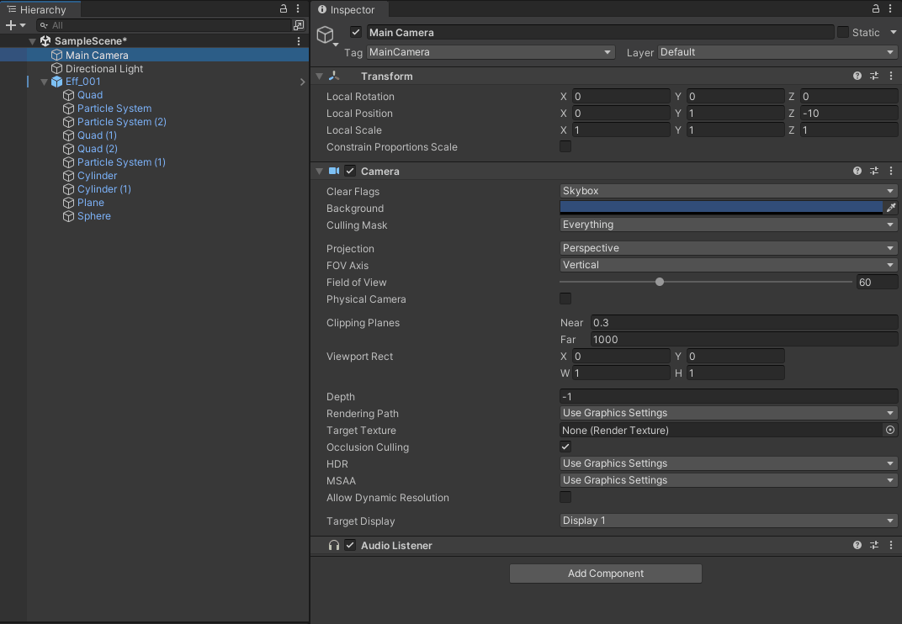
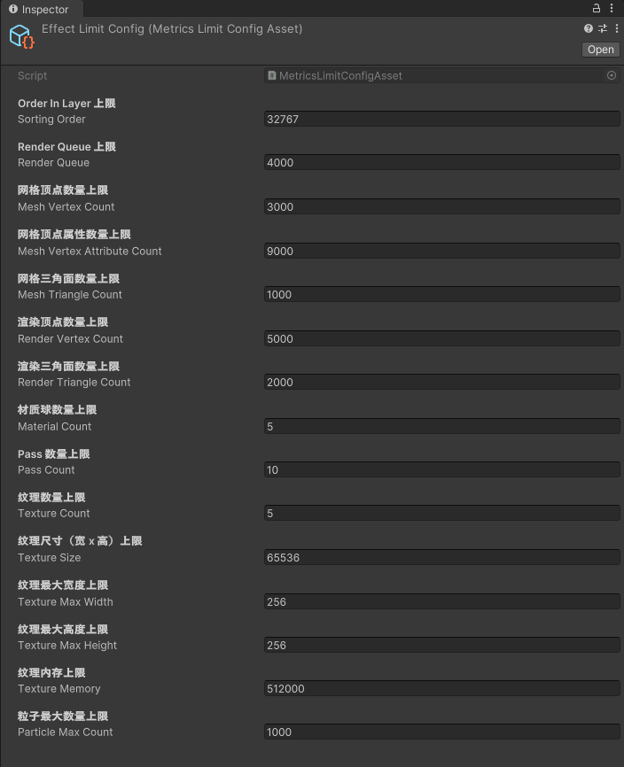
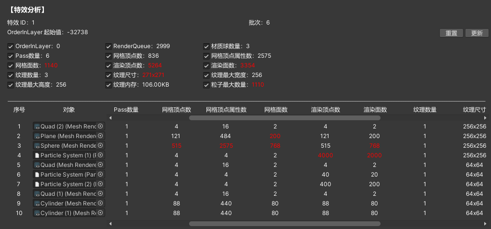
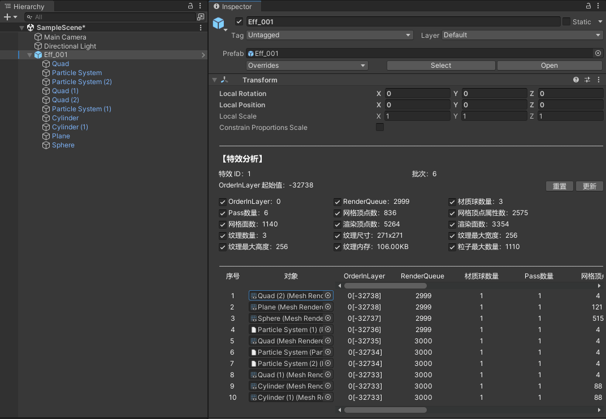
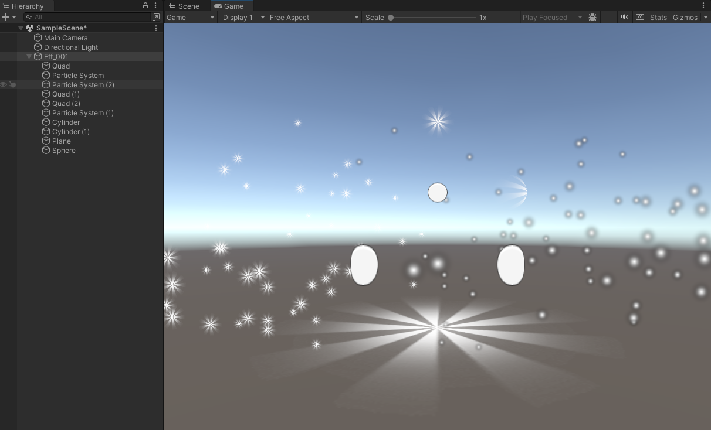
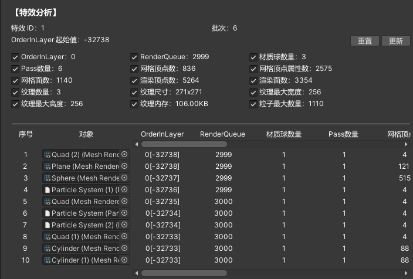
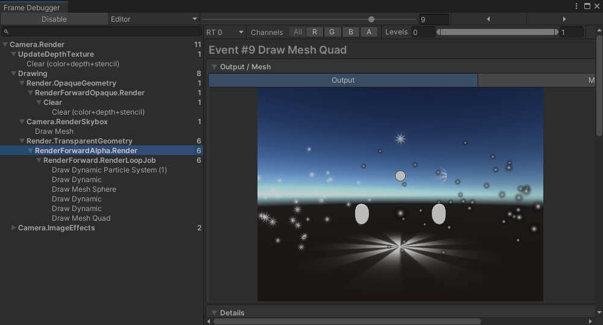

# Effect Performance Analysis
- Effect Performance Analysis 是一款用于 Unity 游戏的特效分析工具，主要功能有：
    - 分析单个特效的性能，包括批次（近似）、顶点数、纹理等信息。
    - 特效层级划分。

## 设计原理
- 所有渲染命令，合并前需要进行拓扑排序，而当出现闭环时，Unity 有自己的一套计算规则，因此需要在场景运行状态中才能得到具体合批结果。而在特效制作及后续排查过程中，如果每次都要重新运行场景，才能得到特效的性能情况，显然效率会非常低下。
- 特效包括粒子特效和非粒子特效，粒子特效仅能通过动态合批方式进行合批，非粒子特效则可以 SRP 或 动态合批方式进行合批。通过检查合批方式的条件，即可近似计算得到最终的合批结果，同时能获取其他性能数据，即可快速分析特效的性能情况。
- 由于场景中的特效数量和种类较多，为了保证性能，特效需要尽可能合批，则需要为每个特效规划层级。对于特效来说，基本上以半透明渲染为主，渲染排序优先级为：`Sorting Layer` > `Order In Layer` > `Render Queue` > z 深度（和相机的距离，从远到近），其中：
    - `Sorting Layer` 添加需要在 `Player Setting` 中的 `Tags And Layers` 中添加，对于上线项目不便于修改。
    - `Order In Layer` 仅在粒子系统中开放，对于 `MeshRenderer` 、`SkinnedMeshRender` 等组件没有开放，且对于多材质（不同 `Render Queue`）的不同对象，渲染顺序会发生变化。
    - `Render Queue` 为材质球上的设置，每个 `Renderer` 对象可能有多个材质球，且材质球可能在不同的对象上复用，分层规划的复杂度较高。
    - z 深度在编辑时可以实现每个特效的层级规划，但加载到场景中后，实际深度会随着特效位置发生变化，原本规划好的层级会失效。
- 综合下来，通过 `Order In Layer` 来规划特效的层级比较容易实现，原因如下：
    - `MeshRenderer` 、`SkinnedMeshRender` 等组件可以通过增加 `CustomEditor` 来实现 `Order In Layer` 的显示。
    - 特效制作过程，如果出现多材质的 `Renderer` 对象，通常是因为该对象需要多个效果叠加才能得到需要的效果，即都是面向单个 `Renderer` 对象进行制作，即便材质为不同的 `Render Queue`，也仅仅是为了确定渲染顺序，基本上不会出现多个对象多个材质球交叉叠加渲染的设计（如： A 对象的材质 1 渲染后，材质 2 需要在 B 对象的材质 1 的渲染结果上叠加渲染才能得到正确效果），因此修改 `Order In Layer` 基本上不会影响原本的设计效果。 
    - 场景中的特效通常是多种类且大量的，通常难以全局规划每种特效的合并关系。而通过 `Order In Layer` 来规划特效的层级，可以确保同一种特效在场景中都能按照设计进行合批，同时也确保了不同特效之间不会相互影响，从而提高特效性能的理论估计值的准确度。

## 初始化配置
### 创建脚本文件
- 通过点击 Unity 菜单栏的 `Effect Performance Analysis/Create All Scripts` ，在 `Assets/EffectPerformanceAnalysis/` 下生成工具所需的所有脚本文件，包括：
    - ./Editor/CustomEffectConfigAsset.cs
        - 特效的配置文件类，用于创建特效配置文件。
    - ./Editor/CustomEditor/MeshRendererEditor.cs
        - MeshRenderer 的编辑器类，用于修改 MeshRenderer 组件的 Inspector 面板，增加 `Order In Layer` 值显示。
    - ./Editor/CustomEditor/SkinnedMeshRendererEditor.cs
        - SkinnedMeshRenderer 的编辑器类，用于修改 SkinnedMeshRenderer 组件的 Inspector 面板，增加 `Order In Layer` 值显示。
    - ./Editor/CustomEditor/TransformEditor.cs
        - Transform 的编辑器类，用于修改 Transform 组件的 Inspector 面板，展示特效性能数据。
    - ./Editor/CustomEditor/CustomEffectConfigAssetEditor.cs
        - `CustomEffectConfigAsset` 的编辑器类，用于自定义 `CustomEffectConfigAsset` 的 Inspector 面板。    
- 如果项目中已经存在部分组件的 `CustomEditor` ，则需要进行手动合并调整。

### 创建配置文件
- 通过点击 Unity 菜单栏的 `Effect Performance Analysis/Create Effect Config Asset` ，在 `Assets/EffectPerformanceAnalysis/Editor` 下生成配置文件 `CustomEffectConfig.asset` ，用于配置特效的信息。只有记录到该配置中的特效，才会进行性能分析和数据显示。
- 配置文件的内容为：
    - `Sorting Order Limit`
        - 单个特效可使用的 `Order In Layer` 的数量。
    - `Config List`
        - 特效列表，记录每一个特效的信息，包括：
            - `Id` ：特效的 ID ，用于标识特效，最小为 0 ，最大为 32767 / `Sorting Order Limit`，每个特效的 ID 都是唯一的。
            - `Prefab` ：特效的预制体对象。
            - `Name` ：特效的名称（通常为预制体名）。 



## 添加特效
- 通过点击 Unity 菜单栏的 `Effect Performance Analysis/Collect All Effects` ，可以收集所有特效预制体加入到配置文件中。其中，收集规则可通过 `CustomEffectConfigAsset.CollectAllEffects` 方法实现，示例如下：
```
...

namespace EffectPerformanceAnalysis
{
    public class CustomEffectConfigAsset : EffectConfigAsset
    {
        ...

        public override void CollectAllEffects(Dictionary<int, GameObject> allEffectsDict)
        {
            var assetPath = "Assets/Effect";
            var dirPath = Path.Combine(Directory.GetCurrentDirectory(), assetPath).Replace("\\", "/");
            var files = Directory.GetFiles(dirPath, "*.prefab", SearchOption.AllDirectories);
            if (files == null)
            {
                return;
            }
            
            int index = 0;
            foreach (var file in files)
            {
                var path = file.Substring(dirPath.Length + 1);
                // 需要记录特效对应的预制体
                var prefab = AssetDatabase.LoadAssetAtPath<GameObject>(Path.Combine(assetPath, path));
                if (prefab != null)
                {
                    // todo：需要使用其他策略来分配特效的 ID，保证 ID 的稳定性
                    var id = index++;   
                    allEffectsDict[id] = prefab;
                }
            }
        }
    }
}
```
- 特效收集每次都会清除原有的特效及 ID 信息，并使用新的 ID 信息进行添加。由于特效 ID 用于特效的层级设置，所以需要尽可能保证每个预制体能分配到稳定的 ID，避免 ID 变更导致需要重新设置特效层级，如：特效名命名为 Eff_XXX.prefab ，其中 XXX 为序号，则 ID 使用该序号即可保证稳定性，即每次生成都会分配到相同的 ID。

## 数据展示
- 完成配置后，点击选中特效预制体，即可在 Inspector 面板中看到特效的性能信息。

- 如图所示，上半部分为特效的整体性能信息，下半部分为每个有效 Renderer 对象（enable 且有材质）的性能信息。
- 每个特效的 Order In Layer 的起始值，由特效的 ID 决定，即：起始值 = ID * `Sorting Order Limit` 。每个 ID 都有固定的 Order In Layer 范围，因此对于同一个特效，当 ID 修改时，Order In Layer 的范围也会改变，需要重新设置特效的层级。
- 每个特效的 `Renderer` 对象，会按照一定的顺序进行排序，使得所有相互能合批的对象都排在一起。排序完成后，对所有对象进行合批检查，从当前特效 ID 对应的 `Order In Layer` 起始值开始，为每个对象分配 `Order In Layer` 值。同一批次的 `Renderer` 对象，使用相同的 `Order In Layer` 层级，不同批次则递增，`[]` 中的值即为计算后的推荐值。对于特效制作过程中预先设定好 `Order In Layer` 的对象，会保留其和其他对象直接的相对关系，从而保证特效层级修改后的表现结果正确性。

## 数据监测
- 通过点击 Unity 菜单栏的 `Effect Performance Analysis/Create Effect Limit Config Asset` 和 `Effect Performance Analysis/Create Effect Renderer Limit Config Asset` ，可分别创建 `EffectLimitConfig.asset` 和 `RendererLimitConfig.asset` ，用于设置特效指标的上限值，其中：
    - `EffectLimitConfig.asset` 用于设置特效整体的指标上限。
    - `RendererLimitConfig.asset` 用于设置单个 `Renderer` 对象的指标上限。
- 设置完成后，数值超过上限值的，则该项结果会显示成红色，从而快速定位性能问题。


## 层级更新
- 对于单个特效，通过点击 Inspector 面板的 “更新” 按钮，即可将推荐值设置到 `Order In Layer` 中。点击 “重置” 按钮，即可将更新后的值设置为从 0 开始的递增值，方便特效制作修改。

- 由于每个特效的 ID 都对应唯一的 `Order In Layer` 范围，因此当特效 ID 发生变化时，需要通过点击 Unity 菜单栏的 `Effect Performance Analysis/Update All Effects 's Order In Layer` ，将所有特效的层级更新为新的 ID 对应的范围。

## 测试数据
- 测试特效预制体如图所示：

- 特效分析工具结果如图：

- Frame Debugger 的运行数据如图：

- 可以看到，特效分析工具的批次和 FramDebugger 的实际批次一致，即可以得到相对近似的结果，同时还带上了各个维度的性能数据，可以方便特效制作人员在制作过程对特效性能数据有一个直观的了解，从而在制作过程中进行优化。